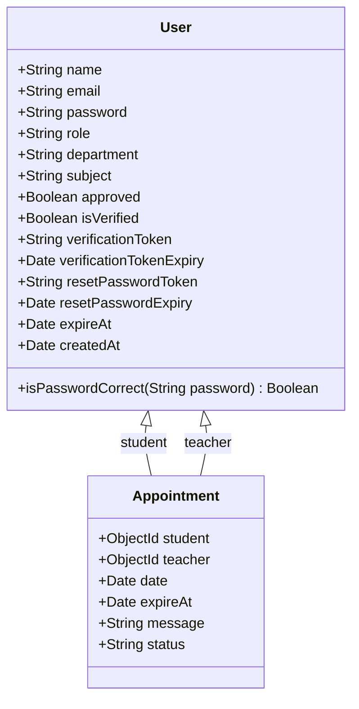
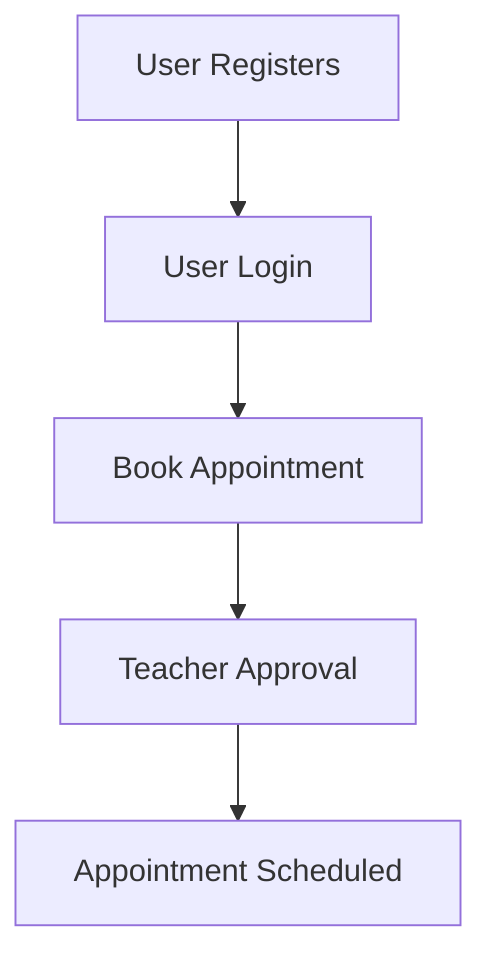

### Low-Level Design Document for Student-Teacher Appointment Booking System

    ....By Omanand Swami

#### Table of Contents

1. [Introduction](#introduction)
2. [System Architecture](#system-architecture)
3. [Module Design](#module-design)
   - [Authentication Module](#authentication-module)
   - [User Management Module](#user-management-module)
   - [Appointment Management Module](#appointment-management-module)
4. [Data Models](#data-models)
5. [API Design](#api-design)
6. [Security Considerations](#security-considerations)
7. [Error Handling](#error-handling)
8. [Testing Strategy](#testing-strategy)
9. [Diagrams](#diagrams)

---

### 1. Introduction

The Student-Teacher Appointment Booking System is a web-based application designed to facilitate the scheduling of appointments between students and teachers. This document provides a detailed low-level design (LLD) for the system, including module descriptions, data models, API design, security considerations, and diagrams.

### 2. System Architecture

The system follows a client-server architecture:

- **Frontend**: React application hosted on a static server.
- **Backend**: Node.js with Express.js, connected to a MongoDB database.
- **Database**: MongoDB for storing user and appointment data.
- **Proxy**: To handle API requests from the frontend to the backend.

### 3. Module Design

#### Authentication Module

- **Responsibilities**:

  - User registration
  - User login
  - Email verification
  - Password reset
- **Components**:

  - `AuthController`: Handles HTTP requests related to authentication.
  - `AuthService`: Business logic for authentication.
  - `UserModel`: Mongoose model for users.
  - `EmailService`: Sends verification and reset emails.

#### User Management Module

- **Responsibilities**:

  - CRUD operations for users (Admin only)
  - Approving or rejecting user registrations (Admin only)
  - Viewing user details (Admin, Teacher, and Student)
- **Components**:

  - `UserController`: Handles HTTP requests related to user management.
  - `UserService`: Business logic for user management.
  - `UserModel`: Mongoose model for users.

#### Appointment Management Module

- **Responsibilities**:

  - Booking appointments (Students)
  - Viewing appointments (Students and Teachers)
  - Managing appointments (Teachers)
  - Viewing all appointments (Admin)
- **Components**:

  - `AppointmentController`: Handles HTTP requests related to appointments.
  - `AppointmentService`: Business logic for appointment management.
  - `AppointmentModel`: Mongoose model for appointments.

### 4. Data Models

#### User Model

```javascript
const UserSchema = new mongoose.Schema({
  name: { type: String, required: true },
  email: { type: String, unique: true, required: true },
  password: { type: String, required: true },
  role: { type: String, enum: ['student', 'teacher', 'admin'], required: true },
  department: { type: String },
  subject: { type: String },
  approved: { type: Boolean, default: false },
  isVerified: { type: Boolean, default: false },
  verificationToken: { type: String },
  verificationTokenExpiry: { type: Date },
  resetPasswordToken: { type: String },
  resetPasswordExpiry: { type: Date },
  expireAt: { type: Date, expires: '2d', default: Date.now },
  createdAt: { type: Date, default: Date.now },
});
```

#### Appointment Model

```javascript
const AppointmentSchema = new mongoose.Schema({
  student: { type: mongoose.Schema.Types.ObjectId, ref: 'User' },
  teacher: { type: mongoose.Schema.Types.ObjectId, ref: 'User' },
  date: { type: Date, required: true },
  expireAt: { type: Date, expires: '2d', default: Date.now },
  message: { type: String },
  status: { type: String, enum: ['Pending', 'Approved', 'Canceled', 'Completed'], default: 'Pending' },
});
```

### 5. API Design

#### Authentication Routes

- **POST /api/auth/register**
  - Registers a new user.
- **POST /api/auth/login**
  - Logs in a user.
- **POST /api/auth/logout**
  - Logs out a user.
- **GET /api/auth/verify-email**
  - Verifies user email.
- **POST /api/auth/forgot-password**
  - Sends a password reset link.
- **POST /api/auth/reset-password**
  - Resets the user's password.

#### User Management Routes

- **GET /api/users**
  - Retrieves all users (Admin only).
- **GET /api/users/:id**
  - Retrieves a specific user.
- **PUT /api/users/:id**
  - Updates a specific user (Admin only).
- **DELETE /api/users/:id**
  - Deletes a specific user (Admin only).

#### Appointment Management Routes

- **POST /api/appointments**
  - Books a new appointment (Student).
- **GET /api/appointments**
  - Retrieves appointments (Student and Teacher).
- **PUT /api/appointments/:id**
  - Updates an appointment (Teacher).
- **DELETE /api/appointments/:id**
  - Cancels an appointment (Student and Teacher).

### 6. Security Considerations

- **JWT Authentication**: Secure routes with JSON Web Tokens.
- **Password Encryption**: Use bcrypt to hash passwords.
- **CAPTCHA**: Implement Google reCAPTCHA to prevent spam.
- **Rate Limiting**: Limit the number of API requests to prevent abuse.

### 7. Error Handling

- **Centralized Error Handling**: Use a middleware to handle errors globally.
- **Validation Errors**: Use validation libraries (e.g., Joi) to handle input validation.
- **HTTP Status Codes**: Return appropriate status codes for different error types.

### 8. Testing Strategy

# Unit Test Cases

| Test Case ID | Description               | Input                    | Expected Output                                | Actual Output | Status  |
| ------------ | ------------------------- | ------------------------ | ---------------------------------------------- | ------------- | ------- |
| UT01         | Verify user registration  | Valid user details       | User is created and verification email is sent |               | Pending |
| UT02         | Verify user login         | Valid email and password | User is logged in and JWT token is generated   |               | Pending |
| UT03         | Verify password hashing   | Plain text password      | Hashed password                                |               | Pending |
| UT04         | Verify email verification | Valid verification token | User is marked as verified                     |               | Pending |
| UT05         | Verify CAPTCHA validation | Valid CAPTCHA token      | CAPTCHA is valid                               |               | Pending |

# Integration Test Cases

| Test Case ID | Description                          | Input                            | Expected Output                                                          | Actual Output | Status  |
| ------------ | ------------------------------------ | -------------------------------- | ------------------------------------------------------------------------ | ------------- | ------- |
| IT01         | User registration and login          | Valid user details               | User is created, verification email is sent, and user can log in         |               | Pending |
| IT02         | Password reset flow                  | Valid email                      | Password reset token is sent to user's email and user can reset password |               | Pending |
| IT03         | Appointment booking                  | Valid student, teacher, and date | Appointment is booked and both student and teacher can view it           |               | Pending |
| IT04         | Admin approving student registration | Valid student ID                 | Student is approved and can log in                                       |               | Pending |
| IT05         | Teacher viewing appointments         | Valid teacher ID                 | Teacher can view all their appointments                                  |               | Pending |

# End-to-End (E2E) Test Cases

| Test Case ID | Description                                | Input                                  | Expected Output                                                       | Actual Output | Status  |
| ------------ | ------------------------------------------ | -------------------------------------- | --------------------------------------------------------------------- | ------------- | ------- |
| E2E01        | User registration, verification, and login | Valid user details                     | User registers, verifies email, and logs in successfully              |               | Pending |
| E2E02        | Password reset                             | Valid email                            | User requests password reset, receives email, and resets password     |               | Pending |
| E2E03        | Student booking appointment                | Valid student login, teacher, and date | Student logs in, books an appointment, and sees it in their dashboard |               | Pending |
| E2E04        | Admin managing users                       | Valid admin login, student details     | Admin logs in, approves a student, and restricts another              |               | Pending |
| E2E05        | Teacher managing appointments              | Valid teacher login                    | Teacher logs in, views their appointments, and marks one as completed |               | Pending |

These tables provide a structured way to define and track the various tests required to ensure the functionality and reliability of your Student-Teacher Appointment Booking System. You can expand these tables with more detailed test cases as needed.

### 9. Diagrams

#### Sequence Diagram

``````mermaid
sequenceDiagram
    User->>AuthController: Register
    AuthController->>AuthService: Validate and Save User
    AuthService->>UserModel: Save User
    UserModel-->>AuthService: User Saved
    AuthService-->>AuthController: User Registered
    AuthController-->>User: Registration Successful

    User->>AuthController: Login
    AuthController->>AuthService: Validate User
    AuthService->>UserModel: Find User by Email
    UserModel-->>AuthService: User Found
    AuthService->>AuthController: Generate JWT
    AuthController-->>User: JWT Token
``````

#### Class Diagram



#### Flowchart


